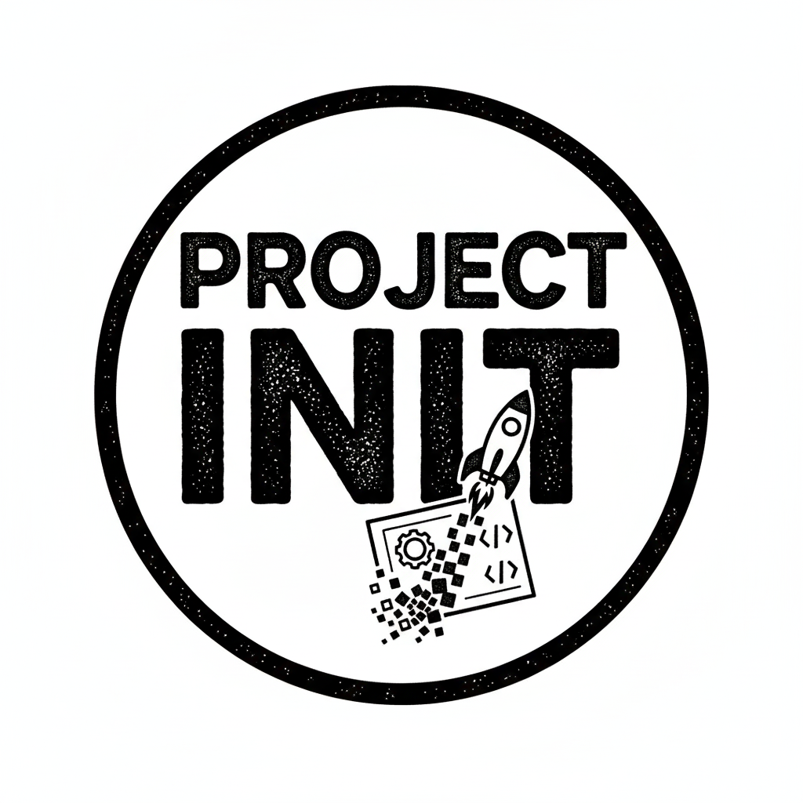

  
  <b>Powered By</b>
  

## Open Source Software Scaffolding Platform

Our goal is to make code that integrates up and down the stack from your infrastructure to your application in a
seamless experience. We are a facet of [Project vNext](https://www.projectvnext.com) where the goal is to make your
engineering effort go from 50% supporting the product to 15%.

